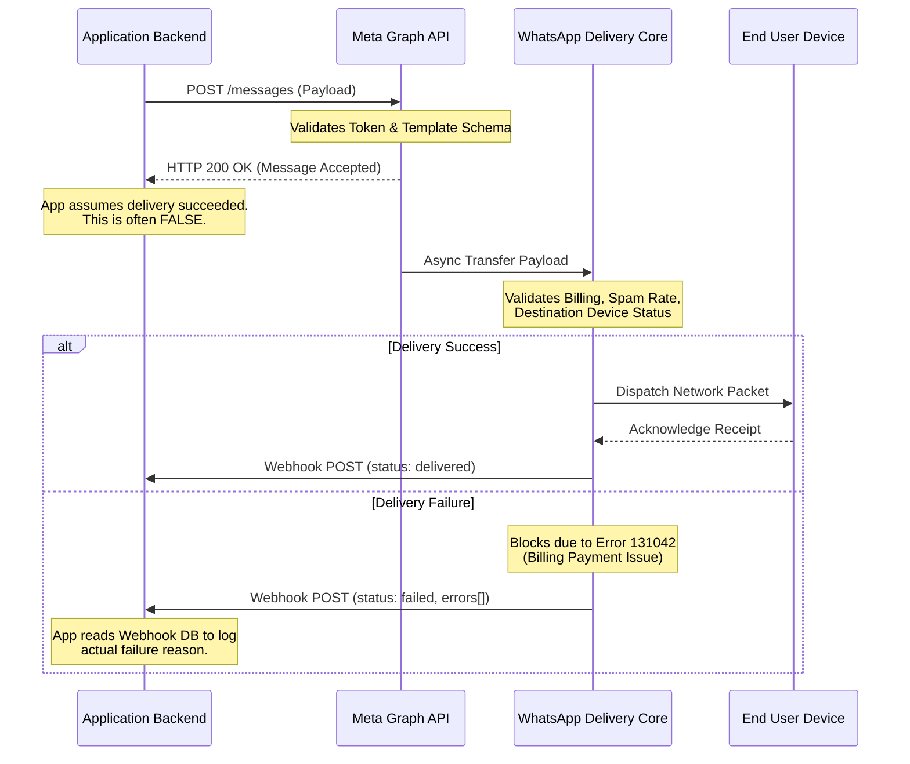
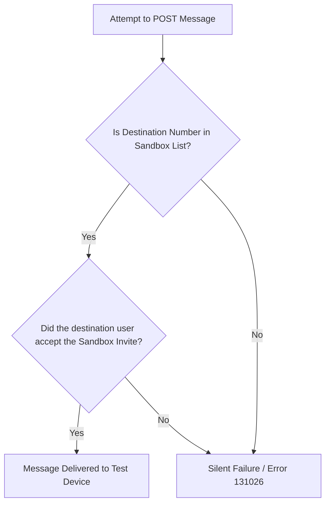
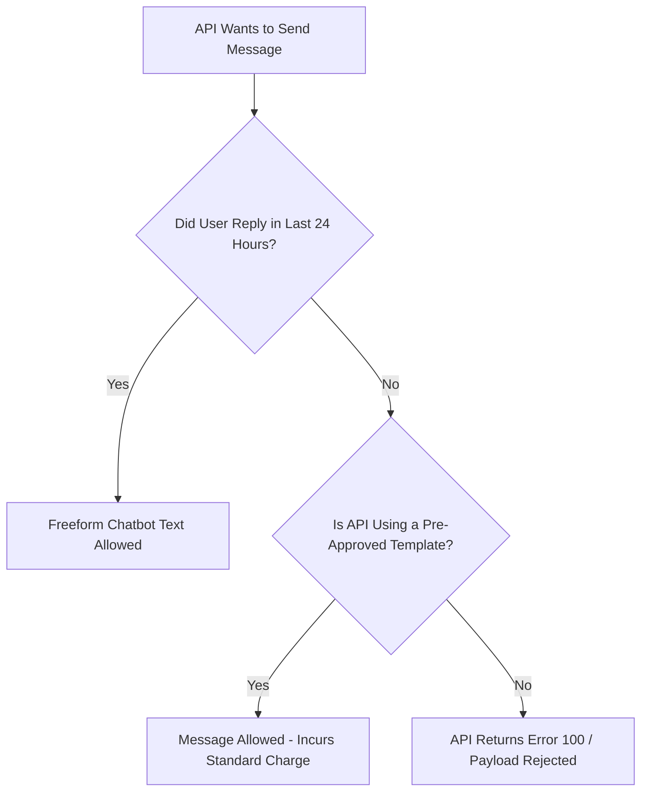

# THE ULTIMATE WHATSAPP BUSINESS API (WABA) INTEGRATION HANDBOOK
*Advanced Implementation Guide, Architectural Motives, and End-to-End Methodologies*

---

## Executive Summary & Core Motivation

Welcome to the definitive, heavily detailed, scratch-to-production master guide for integrating the Meta WhatsApp Business API into any modern web application.

**The "Why"**: The WhatsApp Business API differs significantly from traditional REST APIs like Stripe or Twilio. While most SaaS platforms abstract their complexity behind heavily simplified SDKs, Meta’s ecosystem is fragmented across multiple platforms, portals, and rigid policy engines. If you merely follow the basic Developer Documentation, your application will almost certainly collapse in production due to unexpected sandbox restrictions, 24-hour token expirations, NLP template rejections, or silent asynchronous payload drops.

We wrote this guide completely based on battles fought across bleeding-edge tech stacks (Supabase Databases, Deno Edge Functions, Next.js React forms, Node.js scripts). It is designed so that junior developers and senior architects alike understand not just *how* to invoke endpoints, but exactly *why* Meta forces you to build the architecture this way.

If you read every section deliberately, you will successfully navigate the labyrinth of Meta’s App configurations, bypass Sandbox limitations, overcome silent delivery suppressions, securely authenticate payloads, construct Deno-based Real-Time Webhooks, and permanently authorize Graph API bindings.

---

## High-Level Webhook Delivery Architecture

To understand the scope of the WhatsApp API, you must first understand its asynchronous nature. The following Mermaid diagram illustrates the difference between what your server *thinks* is happening, and what Meta's backend is *actually* doing.



---

## Phase 1: Meta Developer & Business Manager Ground Zero

### Summary
You must create two distinct Meta entities: an **App** (for developers to write code against) and a **Business Portfolio** (for managers to pay bills and register phone numbers).

### The "Why": The Twin-Ecosystem Philosophy
Why does Meta split development into two distinct tools? The App Dashboard is for software engineers who just need API keys and Webhook URLs. The Business Manager is for corporate administrators who handle credit cards, domain verification, and ad accounts. Meta violently separates these concerns for enterprise security, meaning you—the developer—must explicitly cross the bridge and link them together.

### Step-by-Step Execution

#### 1.1 Creating the Core Developer App
You must create a container for your API access.
1. Navigate to the [Meta Developers Dashboard](https://developers.facebook.com/apps/).
2. Click **Create App**.
3. *Crucial:* Select **Other** (do not select consumer tools or gaming), then select **Business**. This forces the App into a B2B container, unlocking business messaging endpoints.
4. Input your App Name (e.g., `BXB Messaging Engine`).
5. Under "Business Portfolio", physically select the Meta Business Account that owns the company (e.g., `BXB Analytics`). If you do not have one, Meta will force you to create a Business Manager Portfolio.

#### 1.2 Attaching the WhatsApp Product
An empty app does nothing. You must install the WhatsApp API Engine into it.
1. Land on the App Dashboard.
2. Scroll to the "Add products to your app" grid.
3. Find **WhatsApp** and click **Setup**.
4. Meta will immediately mount a new sub-menu to the left sidebar called "WhatsApp". You now have access to webhooks, templates, and API setups.

#### 1.3 Linking the Business Portfolio (WABA)
When you instantiated the WhatsApp product, Meta silently compiled a WhatsApp Business Account (WABA) and attached it to the Business Portfolio you selected in Step 1.1. The App and the WABA are now permanently tethered. One generates code, the other generates money.

---

## Phase 2: Phone Numbers & The Verification Gauntlet

### Summary
You must attach physical hardware (a phone number) to the digital Graph API. To prevent spam, Meta places all unverified, unbilled apps in a strict Sandbox that restricts whom you can message to.

### The "Why": Guarding Against Malicious Networks
Why is it so hard to just send a message? Spam. Before Meta opened the API in 2022, SMS providers were flooded with relentless phishing links. Meta requires rigorous corporate verification, physical OTP checks, and strict target-number isolation before they allow a single software app to converse with standard WhatsApp consumers.

### Step-by-Step Execution

#### 2.1 Registering the Official Sending Device
1. On the left sidebar of the Meta Developer App, open **WhatsApp** -> **API Setup**.
2. Scroll down passing the temporary tokens until you see **Step 5: Add a phone number**.
3. Click **Add phone number**. 
4. Provide the exact business name (this is the display name users will see in WhatsApp, e.g., `Filfora Ghar`). 
   *Note: Your display name must pass an automated NLP format check against your business portfolio name to ensure you aren't spoofing brands.*
5. Provide the category (e.g., *Food & Grocery*).
6. Enter the physical phone number. Include the country code. Wait for the OTP (SMS or Voice) to arrive on that physical handset.
7. Enter the code. The number is now bound to the API. 
   **WARNING**: This number can NEVER be used on the standard Consumer WhatsApp App or the standard WhatsApp Business App on a physical phone again while it is bound to the Enterprise Graph API. The API assumes total ownership over the routing node.

#### 2.2 Navigating the Test Number Sandbox
When the API is first minted, Meta protects its users from your code.
*   **The Restriction**: You can only send messages to up to 5 verified "Test" numbers.
*   **The Solution**: On the same **API Setup** page, look for the "To" field dropdown under "Send and receive messages". Click **Manage phone number list**.
*   Add the personal phone numbers of your developers here. They will receive an automated WhatsApp message from Meta asking them to confirm they want to receive test pings. UNTIL THEY VERIFY, MESSAGES TO THEM WILL BOUNCE.



#### 2.3 Required Developer Dashboard IDs
Before leaving this screen, harvest the master API targets.
Look at the API Setup screen. Find and document these into a notepad for your `.env` later:
- **WhatsApp Business Account ID (WABA ID)**
- **Phone Number ID** (This is a 15-digit internal Meta DB foreign key, *not* the physical 10-digit phone number. Ex: `1073723905813415`)

---

## Phase 3: The System User Access Token (The "God Key")

### Summary
The tokens generated on the Developer Dashboard expire in 24 hours. You must migrate to the Business Manager to forge a Permanent System User Token with infinite lifespan and deep API administrative privileges.

### The "Why": OAuth Session Scopes
Why does Meta provide a token that expires so quickly? The temporary token displayed in the Developer portal is strictly tied to *your personal web browser login session* via OAuth. If you use it in production, the moment your browser session terminates (usually within 24 hours), your backend server goes dark, throwing an `OAuthException 190`. A server is not a human, it cannot log in. It needs a "System User" that exists infinitely without an interface.

### Step-by-Step Execution

#### Generating the Permanent System User Token
This happens completely outside the Developer Dashboard.
1. Open a new tab and go to [Meta Business Settings](https://business.facebook.com/settings). This is the Business Portfolio Manager space.
2. In the left vertical tier, find **Users** -> **System Users**.
3. Create a new System User. Name it `API Backend Microservice`. Assign it **Admin** access status.
4. Click on the user. Click **Add Assets**.
5. Select **Apps** on the left menu. Find the App you created in Phase 1 (`BXB Messaging Engine`). Toggle the **Full Control / Manage App** switch to `ON`, and click `Save Changes`.
6. Click the newly illuminated button: **Generate New Token**.
7. In the flyout module:
   *   **Select App**: Your Application.
   *   **Expiration**: Select `Never`.
   *   **Permissions**: You MUST physically search and check TWO checkboxes: `whatsapp_business_messaging` AND `whatsapp_business_management`. Without both, Edge Webhooks will fail.
8. Click **Generate**.
9. **Copy this token immediately. Store it securely. If you click away, Meta permanently obscures it in the database, and you must revoke and regenerate.**

---

## Phase 4: Billing & Eligibility Walls (The Hidden Boss)

### Summary
Meta physically blocks all outbound messages to non-Sandbox numbers unless a valid credit card is linked directly to the specific WhatsApp Business Account (WABA), resulting in a silent asynchronous Delivery Dropped payload.

### The "Why": The 1000 Free Tier Trap
You might think: "But Meta offers 1,000 free service conversations per month, so I don't need a credit card!" This is a fatal assumption.
To prevent malicious developers from scripting tens of thousands of developer accounts and spamming the network under the guise of the "free tier", Meta mandates that a valid financial gateway is present to verify identity and capability. If you send an API call without billing, the Graph API returns `200 OK`, but the delivery server drops the packet and fires the dreaded `Error 131042` to your webhook.

### Step-by-Step Execution

#### Overcoming "Business eligibility payment issue" (Error 131042)
1. Go to **Meta Business Settings**.
2. Scroll to the bottom left and enter the **WhatsApp Accounts** menu.
3. Select your WABA (e.g., `BXB Analytics`).
4. Click the **Settings** tab.
5. In the middle of the screen, you will see a prominent warning regarding Billing, or a link reading "Payment Methods".
6. Follow the flow to attach a recognized credit card to the specific Meta isolated billing matrix for WhatsApp.
7. The moment the card authorizes, the Sandbox restrictions shatter globally. Your app is now legally permitted to message *any* phone number globally.

---

## Phase 5: Architecting the Environment Configuration

### Summary
Serverless architectures demand strictly managed environment variables to hide the System User Token from the frontend client.

### The "Why": Zero-Trust Graph Endpoints
Your frontend React/Next.js client should NEVER speak to Meta. If it does, your Infinite "God Key" token is shipped to the browser, allowing any user to copy it from Chrome DevTools and seize absolute control of your corporate WhatsApp channel, bankrupting your credit card. All Graph API invocations must happen dynamically on an isolated Edge Function (like Deno on Supabase).

### Step-by-Step Execution

#### 5.1 Local `.env` Structure
Store these in the root of your Node/Next.js execution environment folder. Never commit this to Git.

```env
# Meta Base Constants
WHATSAPP_APP_ID=2347172119111059
WHATSAPP_APP_SECRET=da2aa40237801b4437b8352c9ccdcec4
WHATSAPP_WABA_ID=943911108074452

# Delivery Configuration
WHATSAPP_PHONE_NUMBER=15557499742
WHATSAPP_PHONE_NUMBER_ID=1073723905813415

# Security Artifacts
# The System User Token from Phase 3
WHATSAPP_ACCESS_TOKEN=EAAhWvZAhi5Z...   
# An arbitrary password you create to verify Meta Webhooks
WHATSAPP_VERIFY_TOKEN=super_secure_verification_string_123
# The location your Edge Function will be deployed
WHATSAPP_WEBHOOK_URL=https://[PROJECT].supabase.co/functions/v1/whatsapp-webhook
```

#### 5.2 Securing Remote Edge Environments
If using Supabase, these exact keys must be securely mirrored to the vault. A local `.env` does not push itself to Deno edge environments automatically. You must synchronize the vault via the CLI.
```bash
supabase secrets set WHATSAPP_ACCESS_TOKEN=EAA...
supabase secrets set WHATSAPP_PHONE_NUMBER=...
supabase secrets set WHATSAPP_PHONE_NUMBER_ID=...
supabase secrets set WHATSAPP_VERIFY_TOKEN=...
supabase secrets set WHATSAPP_WABA_ID=...
```

---

## Phase 6: Crafting Approved Message Templates

### Summary
You cannot send arbitrary text arrays to customers to initiate conversations. You must use pre-approved Templates mapped to exact JSON payload variables.

### The "Why": The 24-Hour Customer Service Window
If a customer sends a message to your WhatsApp number, Meta opens exactly a 24-hour "window." Within this window, your API can send them freeform text (like a chatbot). When the window closes, your API is banned from sending freeform text. 
Because your application is initiating *unsolicited* transactional alerts (like OTPs on login, or Order Confirmations on checkout), the window is closed. You MUST use an approved template to break the window. 



### Step-by-Step Execution

#### 6.1 Understanding Template Categories
Go to **WhatsApp Manager** -> **Account Tools** -> **Message Templates**.
1. **Utility Templates**: For confirming actions immediately requested by users. (e.g., Order updates, account updates, ticket statuses). Approval takes minutes.
2. **Authentication Templates**: Specifically enforced for One Time Passwords (OTPs). These are legally hyper-regulated and require mandatory Meta UI buttons or "Copy Code" UX components. They often get rejected if your business is vaguely documented.
3. **Marketing Templates**: Promotional event blasts. Heavily policed for spam.

#### 6.2 Variable Interpolation & NLP Rules
*   Name your templates `snake_case` (e.g., `test_tempalte`, `order_confirmed`).
*   Variables are defined as `{{1}}`, `{{2}}` sequentially inside the text string.
*   **WARNING - The Meta NLP Rejection**: Meta uses AI to parse your variables upon submission. You cannot use a utility template if the text feels too short, vague, or if the variable constitutes the entire string.
    *   *Bad:* `Your code is {{1}}`
    *   *Good:* `Welcome {{1}}, your requested access token is {{2}}. Please consult {{3}} for further inquiries.`

#### 6.3 The Bypass Workaround for OTPs
Meta notoriously demands a registered physical business document to approve "Authentication" layout templates. 
**The Cheat Code**: You can bypass this by disguising the OTP inside a standard "Utility" template. Create a template titled `support_ticket`. Set the text to `Your requested service request ID is {{1}}.` When sending the OTP, map the generated OTP integer to parameter `{{1}}`. The user receives the validation code securely, and Meta's Template AI parses it simply as a generic support ticket update.

---

## Phase 7: Executing The Graph API Send Payload

### Summary
Constructing the payload mathematically aligned with the approved template map, and launching it via the Graph REST API over a secure Deno edge node.

### The "Why": Strict JSON Typing
The Graph API endpoint enforces hyper-strict parameter typing. If your template requires 3 variables, passing 2 destroys the payload (`Error 100`). If your template specified language `en_US`, dispatching a payload designating `en` or `en_us` destroys the payload. Meta uses these keys as database indices to find the template HTML structure on their massive delivery clusters.

### Step-by-Step Execution

#### 7.1 Understanding the `/messages` Endpoint
The target format is universally:
`https://graph.facebook.com/v17.0/[WHATSAPP_PHONE_NUMBER_ID]/messages`

#### 7.2 Structuring the JSON Body for Templates
The JSON body must exactly map to the variables configured on the Meta dashboard for that specific template name. 

**Example Standard Request Payload:**
Notice how deeply nested the exact template parameters are. Every parameter must explicitly be marked as `{"type": "text"}` before declaring the internal map object containing the exact `{"text": "VariableString"}` formatting rule.

```json
{
  "messaging_product": "whatsapp",
  "to": "918369165384",
  "type": "template",
  "template": {
    "name": "test_tempalte",
    "language": {
      "code": "en_US"
    },
    "components": [
      {
        "type": "body",
        "parameters": [
          { "type": "text", "text": "Hamdan" },
          { "type": "text", "text": "Apt 2B" },
          { "type": "text", "text": "Support Team" }
        ]
      }
    ]
  }
}
```

When you dispatch this payload holding a `Bearer` authorization generated in Phase 3, Meta intercepts the node, compares it to template schemas, formats the text natively on their server, and routes it to `918369165384` without the client device ever knowing where the original Edge API server was physically located.

---

## Phase 8: The Delivery Blackhole & Webhook Architecture

### Summary
Because the Graph API only confirms "Payload Format was Acceptable," developers are blind to whether the user *actually* received the message. Establishing an HTTP Webhook script forces Meta to alert your database with granular delivery states instantly.

### The "Why": Escaping the Blackhole
Many developers dispatch a message, receive an `{"id": "wamid.HBA..."}`, log it as successful, and ignore it. Moments later, their users complain they aren't receiving OTPs. Why? 
Because Meta placed the valid message on an asynchronous internal routing queue. The routing queue discovered the recipient's phone number was disconnected, and aborted delivery at the telecom boundary. Because there are no webhooks configured, the developer is completely blinded to the telecom error.

### Step-by-Step Execution

#### 8.1 Building the Edge Function Webhook Receiver
A webhook is simply a public-facing script. We deploy this inside Supabase Edge Functions (`whatsapp-webhook/index.ts`).
The webhook serves two completely unique purposes handled simultaneously on the exact same HTTP route.

#### 8.2 The Initial Handshake (GET)
When you first attempt to attach the webhook URL to Meta's dashboard (in Phase 9), Meta distrusts the URL. To prevent DDOS attacks, Meta will fire an HTTP `GET` request to your script holding a `hub.verify_token` string that you defined locally in Phase 5, and a wildly long numeric string called `hub.challenge`.
Your code MUST catch the URL parameters, confirm the token mathematically matches your `.env`, and respond immediately with *solely* the raw numeric string provided in `hub.challenge`.
If your server returns JSON, an HTML body, or anything else, Meta aborts the handshake instantly.

#### 8.3 Payload Unpacking & Structuring (POST)
Once the handshake completes, Meta will relentlessly hammer your script with HTTP `POST` requests detailing the exact cellular journey of every WAMID (WhatsApp Message ID).

**The Golden Webhook Script Architecture (Deno + Supabase Schema)**:
This script performs Handshakes on `GET` and filters out deeply-nested `object.entry.changes` failures on `POST`, mapping the exact telemetry errors to a database table or logging engine.

```typescript
import { serve } from "https://deno.land/std@0.168.0/http/server.ts";

const WHATSAPP_VERIFY_TOKEN = Deno.env.get("WHATSAPP_VERIFY_TOKEN")!;

serve(async (req: Request) => {
    const url = new URL(req.url);

    // Context 1: Meta Verification Handshake
    if (req.method === 'GET') {
        const mode = url.searchParams.get('hub.mode');
        const token = url.searchParams.get('hub.verify_token');
        const challenge = url.searchParams.get('hub.challenge');

        if (mode === 'subscribe' && token === WHATSAPP_VERIFY_TOKEN) {
            console.log("Handshake Verified.");
            return new Response(challenge, { status: 200 }); // Returns raw text
        }
        return new Response('Forbidden', { status: 403 });
    }

    // Context 2: Real-Time Event Telemetry
    if (req.method === 'POST') {
        try {
            const payload = await req.json();
            
            // Critical Event Demultiplexer Logic
            if (payload.object === 'whatsapp_business_account') {
                for (const entry of payload.entry) {
                    const changes = entry.changes[0]?.value;
                    if (changes?.statuses) {
                        const statusObj = changes.statuses[0];
                        
                        // Example: statusObj.id -> 'wamid.HBLx...'
                        // Example: statusObj.status -> 'sent' | 'delivered' | 'read' | 'failed'
                        
                        // IF delivery failed, interrogate deeply:
                        if (statusObj.errors) {
                             const failureNode = statusObj.errors[0];
                             const code = failureNode.code;
                             const title = failureNode.title;
                             console.error(`Alert: WAMID ${statusObj.id} failed due to ${title} | Code: ${code}`);

                             // NOTE: Implement Data insertion queries here to update your 'communications' SQL table
                        }
                    }
                }
            }

            // Acknowledge routing instantly to prevent Meta throttling retries
            return new Response('EVENT_RECEIVED', { status: 200 });
        } catch (e: any) {
            return new Response('Internal Server Error', { status: 500 });
        }
    }
});
```

---

## Phase 9: Binding the Webhook to Meta Servers

### Summary
The final integration step mapping the Cloud Function Webhook Route to the WABA Event Publisher using both the Graphical Dashboard and a mandatory REST API confirmation handshake.

### The "Why": Double Authentication Bindings
Meta ensures that neither the App Developer nor the WABA administrator can independently hijack messaging telemetry. Both must authorize the bond. First, the Webhook is registered on the Developer App dashboard. Then, the Graph API forces the specific WABA entity to formally "subscribe" to the App's webhook feed via token logic. 

### Step-by-Step Execution

#### 9.1 Developer Dashboard Configuration
1. Go to your Meta App Dashboard -> **WhatsApp > Configuration**.
2. Locate the "Webhook" module grid. Click **Edit**.
3. **Callback URL**: Enter your deployed Edge Function route (e.g., `https://fzyxupsixmfxteeudmxg.supabase.co/functions/v1/whatsapp-webhook`)
4. **Verify Token**: Type the exact arbitrary string you configured in `.env.local`  `WHATSAPP_VERIFY_TOKEN` (e.g., `filfora_waba_secret_2026`).
5. Click **Verify and Save**. Meta will execute the Phase 8 `GET` handshake right now. If it succeeds, the module locks permanently into the UI.
6. Beneath the locked URL, click **Manage** Webhook Fields. Select **Subscribe** next to `messages`.

#### 9.2 The "Subscribed Apps" Graph API Command (CRITICAL)
Oftentimes, clicking "Subscribe" on the Developer App doesn't fully command the underlying WhatsApp Business Account (WABA) to route telemetry securely to the App. You must manually kick-start the engine mapping logic using the `/subscribed_apps` REST endpoint.

Execute this in your bash terminal against the Graph API, injecting the Permanent Admin Token generated in Phase 3.
```bash
curl -X POST "https://graph.facebook.com/v17.0/[WHATSAPP_WABA_ID]/subscribed_apps" \
     -H "Authorization: Bearer [WHATSAPP_ACCESS_TOKEN]" \
     -H "Content-Type: application/json"
```
The Graph AI node will triangulate the relationship between the System Token User, the Meta Developer App space, and the actual WABA hierarchy. When it completes, it routes back `{"success": true}`. 

From that exact second onward, any message payload hitting a `status_change` boundary will result in an instantaneous `POST` intercept hitting your cloud endpoint.

---

## Phase 10: Supreme Error Code Dictionary & Edge-Cases

This section outlines the architectural failures typically exposed *after* a successful Graph dispatch, as captured exclusively by your newly armored Webhooks array.

### Error Taxonomy Diagnostics

| Meta System Code | Standard Internal Output Title | Why it Happened | Solution / Diagnostic Action Paradigm |
| :--- | :--- | :--- | :--- |
| **`100`** | `Invalid Parameter` | The JSON shape formed in your Deno function inherently violates the schema approved in Meta Template Settings. | This indicates casing mismatches (using `en` instead of `en_US` language code), trailing whitespaces in the phone number variables, or injecting strings where the template specified URL headers. Rewrite the `JSON.stringify()` mapping object. |
| **`131009`** | `Parameter format mismatch` | A component nested deeper in the object structure holds an invalid data type. | Frequently surfaces when developers accidentally pass numerical integers (`15`) instead of converted strings (`"15"`) into the `text: ` literal node mapping. Force string casting `String(val)`. |
| **`131026`** | `Message Undeliverable` | Meta safely evaluated the API request, bypassed origin filters, and attempted to dispatch the payload to the foreign telecom provider. The provider rejected it. | The recipient device does not have WhatsApp installed, the number was disconnected entirely, or the target explicitly blocked the WABA's origin. Ensure databases systematically cull numbers generating consecutive `131026` traps to preserve your domain's spam reputation metrics. |
| **`131042`** | `Business eligibility payment issue` | The Developer correctly provisioned Sandbox Tiering but attempted to interface with a non-test destination without establishing a financial ledger with Meta. | Meta rigidly blocks all traffic from breaching the environment hull until a verifiable Credit Module is legally bound to the WABA origin node located deep within Business Settings under "Payment Methods". Refer to Phase 4. |
| **`131048`** | `Spam Rate Limit Hit` | The script invoked loops executing redundant template structures toward similar geographic clusters. | Meta AI dynamically interpreted the sequence as malicious bulk behavior and autonomously rate-limited the execution hub. Transition from linear `forEach` loops to delayed queuing structures pacing payloads across rolling windows to avoid recursive bans. |
| **`132001`** | `Template does not exist` | The template string referenced in the JSON mapping `name:` element literally does not exist. | It was either deleted by a business admin, rejected entirely by the AI NLP filter, or the language specifier referenced an unpublished localization variant (e.g. searching for Spanish translations on an English-only template). |
| **`190`** | `Invalid OAuth 2.0 Access Token` | The client environment was deployed using the 24-hour debug token provided temporarily in the GUI interface setup phase. It has now expired. | Refer immediately to Phase 3 System User Token generation procedures to permanently override the timeout scope and rotate the `.env` secrets. |

---
*This concludes the Ultimate WhatsApp API Integration Engineering reference documentation.*
